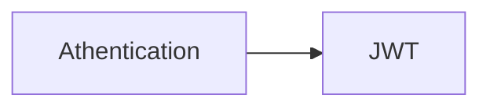

# spacesAtFanpit
Find, Book, Celebrate.

## Timeline
### Checkpoint 1( deliveriables ): Project setup, Authentication & Integration.
#### Setup:
1. `www` ( source package for Frontend ), 
2. `nest` for backend,
   - Containerised `nest` application for auth handling (JWT), DB (MongoDB) connection 

#### Authentication
1. Authentication using JWT (JSON Web Tokens),

