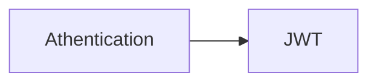

# spacesAtFanpit
Find, Book, Celebrate.

#### feature-branches
`www`
- [x] login screen 

`nest`
- [ ] 
## Timeline
### Checkpoint 1( deliverables ): Project setup, Authentication & Integration.
#### Setup:
- [x] `www` ( source package for Frontend ), 
- [x] `nest` for backend,
   - Containerised `nest` application for auth handling (JWT), DB (MongoDB) connection 
- [x] containers for MongoDB (`local testing`), and MongoDB Atlas (`Hosted`).

#### Authentication
- [ ] mongoDB collection for storing user-credentials ( email, password (hashed)),
- [ ] Routes: Authorisation
   - `/client` - Browse spaces, sign-up/loing, see real-time availability, place reservations, pay via Razorpay, view/cancel bookings. 
   - `/staff` - View daily reservations list, scan/enter booking code, mark guests, checked-in/out, flag issues 
   - `/admin` - CRUD own spaces, upload images, configure pricing rules, view/filter reservations, mark no-shows, basic analytics.

#### Planned:
- [ ] Razorpay integration
- [ ] 
